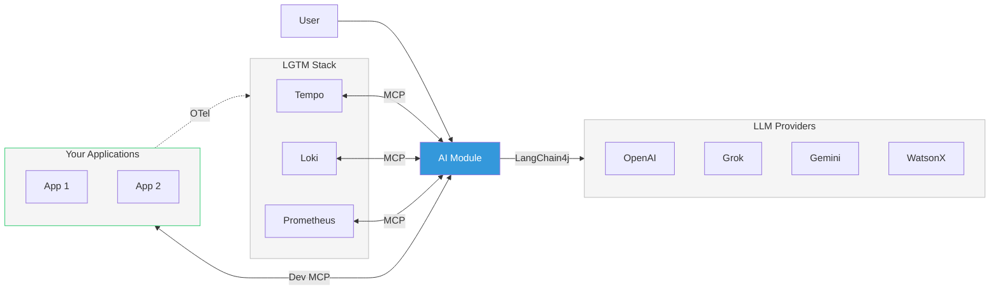
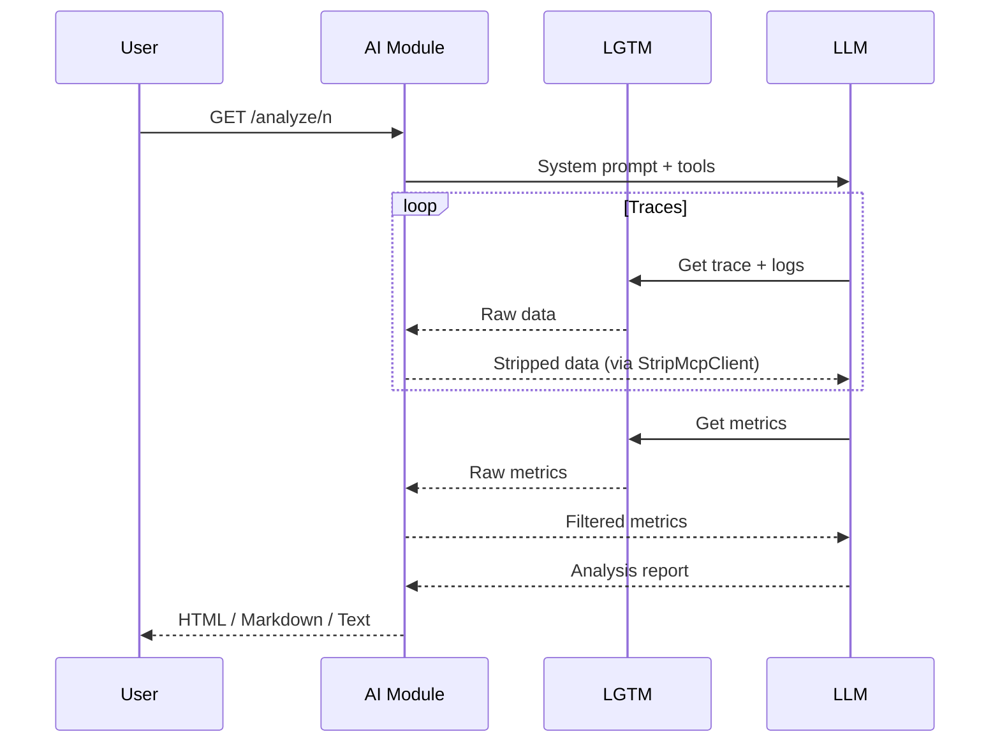
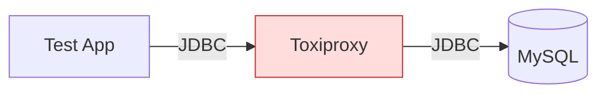
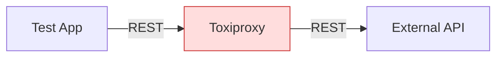

# Telemetry AI: LLM-Powered Root-Cause Analysis for Distributed Systems

When something goes wrong in a distributed system, engineers face the same ritual: open Grafana, dig through traces in Tempo, correlate logs in Loki, check Prometheus metrics, and mentally piece together a causal chain across services. What if an LLM could do that for you — pulling telemetry from the same tools you already use and producing a structured root-cause analysis in seconds?

That's what **Telemetry AI** does. It's an open-source Quarkus application that connects to your existing Grafana LGTM stack via MCP (Model Context Protocol), feeds correlated traces, logs, and metrics to an LLM, and returns actionable analysis — complete with root causes, severity assessments, and remediation suggestions.

This post walks through how it works, how to run it, and how we test it using chaos engineering with LLM-as-judge evaluation.

## What It Does

Telemetry AI is a standalone analysis engine. Point it at your LGTM stack and your running applications, and it will:

- **Retrieve recent traces** from Tempo via MCP and identify the interesting ones (errors, high latency, unusual patterns)
- **Correlate logs** for each trace from Loki, linking log entries to specific spans
- **Pull Prometheus metrics** at the time window of each trace to add system-level context
- **Analyze everything together** using an LLM, producing a structured report that distinguishes root causes from symptoms, identifies cascading failures, and suggests next steps

Optionally, it can also:

- **Examine source code** of monitored applications via Dev MCP, correlating analysis findings back to specific code paths
- **Generate Grafana dashboards** tailored to the issues it found, saved directly into each application's workspace

The key insight is the data pipeline. Raw telemetry from MCP is noisy — SDK metadata, localhost attributes, histogram buckets, Netty internals, per-region breakdowns. A `StripMcpClient` decorator filters this aggressively (94% reduction on metrics: 586 entries down to ~35) before it reaches the LLM, keeping the context window focused on signals that matter.

## Architecture

The system has a layered architecture connecting monitored applications to the AI analysis engine through an observability stack:



Your applications just need OpenTelemetry instrumentation — no code changes required. The AI module connects to your existing LGTM stack via MCP and optionally to your running Quarkus applications via Dev MCP for source examination and dashboard generation.

The AI module uses [LangChain4j](https://docs.langchain4j.dev/) `@RegisterAiService` interfaces backed by a ~290-line system prompt that instructs the LLM on three-way telemetry correlation, chaos detection patterns, severity classification, and structured output formatting.

Five tools are exposed to the LLM during analysis:

| Tool | What It Provides |
|------|-----------------|
| `provideLastNTraceIds` | Recent trace IDs from Tempo (TraceQL) |
| `traceById` | Full trace data for a specific trace |
| `logsWithTraceId` | Correlated Loki logs for a trace |
| `getRootSpanStartTime` | Timestamp for metric queries |
| `getAllMetricsForDatetime` | Prometheus metrics at a point in time |

The LLM orchestrates these tools autonomously — it decides which traces look interesting, pulls their logs, checks metrics, and builds the analysis iteratively.

## The Analysis Pipeline

When you hit `GET /analyze/{n}`, the following sequence unfolds:

1. **Tool dispatch** — The AI module sends the system prompt and tool definitions to the LLM
2. **Trace retrieval** — The LLM calls `provideLastNTraceIds` to get the N most recent traces
3. **Per-trace investigation** — For each trace, the LLM pulls full trace data and correlated logs through `StripMcpClient`, which strips SDK noise, localhost attributes, and redundant fields
4. **Metrics context** — The LLM queries Prometheus metrics at the root span's start time; the filtering layer removes Netty/OTel internals, static counters, and histogram bucket breakdowns
5. **Analysis synthesis** — The LLM produces a structured report with per-trace sections covering root cause, slowest operations, error patterns, and cross-trace correlation

If source examination or dashboard generation is enabled, a post-analysis pipeline kicks in using `DevMcpAiService` — a separate `@RegisterAiService` that uses Dev MCP tools to read application source code and write Grafana dashboard JSON back to each workspace.



## Running It

### Dev Mode (Recommended for Getting Started)

The easiest way to try Telemetry AI is dev mode, which auto-starts an LGTM stack via Quarkus Dev Services:

```bash
git clone https://github.com/quarkiverse/quarkus-telemetry-ai.git
cd quarkus-telemetry-ai

export OPENAI_API_KEY=sk-...   # or GROK_API_KEY for Grok

# Start the AI module pointing at companion app ports
./dev-ai.sh 8081,8082
```

Dev Services automatically starts a Grafana LGTM container (Tempo, Loki, Prometheus) — no Docker Compose or manual setup needed. The `app.ports` argument tells the AI module which of your application ports to connect to for source examination and dashboard generation via Dev MCP.

### Production Mode (Existing LGTM)

For connecting to an existing LGTM instance, use the pre-built uber-jar:

```bash
# Build
./mvn.ai.sh package -DskipTests

# Run
./run-ai.sh 8081,8082 http://localhost:3000 http://localhost:3200
```

The uber-jar is also published to Maven Central as `io.quarkiverse.telemetry:telemetry-ai-core:<version>:jar:runner`.

### LLM Provider Selection

Telemetry AI supports multiple LLM providers via Maven/Quarkus profiles:

```bash
./mvn.ai.sh quarkus:dev              # OpenAI (default, gpt-4o-mini)
./mvn.ai.sh quarkus:dev -Pgrok       # Grok/xAI (grok-3-mini)
./mvn.ai.sh quarkus:dev -Pgemini     # Gemini
./mvn.ai.sh quarkus:dev -Pwatsonx    # WatsonX (Granite)
```

Each profile activates the corresponding LangChain4j extension and Quarkus configuration. Grok uses the OpenAI-compatible API at `https://api.x.ai/v1`.

## The Web UI

Open `http://localhost:8080` to access the analysis UI:


The interface provides:

- **Traces** — number of recent traces to analyze (1-20)
- **Output Format** — HTML, Markdown, Plain Text, or AsciiDoc
- **Examine Source** — include source code examination via Dev MCP
- **Create Dashboard** — generate a Grafana dashboard JSON from findings

After clicking **Analyze**, the UI shows a performance stats bar (duration, LLM calls, input/output tokens) and three collapsible result sections:

1. **Analysis** — the main telemetry analysis with per-trace root cause, error patterns, latency breakdown, and cross-trace correlation
2. **Examined Sources** — source code snippets linked to analysis findings, rendered as Markdown
3. **Dashboard** — generated Grafana dashboard definition as JSON


*Source examination correlates analysis findings back to application code*


*Generated Grafana dashboard with JVM, CPU, and application metrics panels*

Each section has a **Copy** button for clipboard export.

## Testing with Chaos Engineering

How do you test an AI-powered analysis tool? You need realistic failure scenarios with known root causes, and you need an objective way to score the analysis quality. Telemetry AI solves this with chaos engineering + LLM-as-judge evaluation.

### Chaos Scenarios

The project includes companion test applications that simulate distributed microservices with configurable chaos failure modes. These expose 11 chaos types via `GET /chaos?type={type}&intensity={value}`:

| Chaos Type | What It Does |
|-----------|-------------|
| `delay` | Thread.sleep for configurable milliseconds |
| `memory` | Allocate N MB (released after request) |
| `cpu` | CPU burn loop for N ms |
| `leak` | Allocate N MB (never freed) |
| `error` | Random 5xx WebApplicationException |
| `exception` | Unhandled RuntimeException (HTTP 500) |
| `threadpool` | Block 10 threads via CountDownLatch |
| `contention` | 10 threads competing for a synchronized lock |
| `gc` | Rapid alloc/dealloc → GC pressure |
| `intermittent` | Random failures at configurable rate |
| `deadlock` | Two threads deadlocked on competing locks |

### Database and Weather Chaos

Beyond application-level chaos, the test suite also covers infrastructure-level failures using **Toxiproxy** — a TCP proxy that can inject latency, cut connections, and throttle bandwidth at the network layer:

**Database chaos** routes JDBC connections through Toxiproxy to MySQL:



Tests include slow queries (3s latency injection), connection pool exhaustion (4s latency + small pool + concurrent requests), and full database outages (connection cut). JDBC telemetry creates separate database query spans, so the AI sees `GET /poke (3019ms) → SELECT ... (3015ms)` and can identify database-level root causes.

**Weather API chaos** routes REST client calls through Toxiproxy to an external API:



Tests include slow external API responses and full API outages.

No application code changes are required — chaos is injected purely at the network layer via the Toxiproxy REST API.

### The Evaluation Mechanism: LLM-as-Judge

Each integration test follows the same pattern:

1. **Inject chaos** into the test application (or do nothing for baseline tests)
2. **Wait** for telemetry to propagate to LGTM
3. **Run analysis** via `GET /analyze/{n}`
4. **Capture** all tool outputs (raw telemetry data the LLM saw)
5. **Score** the analysis using a separate LLM call

The scoring uses an `AnalysisEvaluationStrategy` that builds a detailed evaluation prompt containing:

- The original telemetry data (traces, logs, metrics) the AI analyzed
- The system prompt used for analysis
- The analysis output being evaluated
- Scenario-specific evaluation criteria

A judge LLM (`EvaluationJudge`) then scores the analysis on four dimensions, each worth 0-25 points:

| Dimension | What It Measures |
|-----------|-----------------|
| **Completeness** | Did it find all the issues present in the telemetry? |
| **Accuracy** | Are the identified root causes correct? |
| **Correlation Quality** | Did it properly link traces, logs, and metrics? |
| **Actionability** | Are the remediation suggestions useful and specific? |

The passing threshold is **70/100**. If the score falls below 0.7, the evaluation also outputs **prompt improvement suggestions** — concrete changes to the system prompt that would improve analysis quality. This creates a feedback loop: run tests, get scores, improve the prompt, run tests again.

### Cross-LLM Combinations

A critical design choice is that the **analyzer LLM** and the **scorer LLM** can be different providers. This prevents self-evaluation bias — an LLM scoring its own output might be systematically lenient.

The test scripts support all combinations:

```bash
./run-integration-test.sh chaos openai grok     # AI=OpenAI, scorer=Grok
./run-integration-test.sh chaos grok openai     # AI=Grok, scorer=OpenAI
./run-integration-test.sh db openai grok        # DB tests, cross-provider
./run-integration-test.sh weather grok grok     # Weather tests, same provider
```

All 19 test scenarios pass across provider combinations:

| AI Provider | Scorer | Chaos | DB | Weather |
|-------------|--------|-------|-----|---------|
| OpenAI | Grok | 12/12 | 4/4 | 3/3 |
| Grok | OpenAI | 12/12 | 4/4 | 3/3 |
| OpenAI | OpenAI | 12/12 | 4/4 | 3/3 |
| Grok | Grok | 12/12 | 4/4 | 3/3 |

The cross-provider combinations (OpenAI/Grok, Grok/OpenAI) are the most important — they validate that analysis quality is genuine, not an artifact of one LLM being generous about its own or a peer's output.

## Data Filtering: Staying Within Context Limits

One of the trickiest engineering challenges is keeping telemetry data within LLM context limits while preserving signal. The `StripMcpClient` decorator applies per-tool filtering functions:

- **Traces**: Removes SDK metadata (`telemetry.sdk.*`, `otel.*`), localhost attributes, and instrumentation library details
- **Logs**: Strips SDK metadata, redundant fields, and duplicate information already present in trace spans
- **Metrics**: Removes Netty internals, static/constant values, histogram bucket breakdowns, and per-region metric breakdowns — reducing 586 entries to ~35

The system prompt also instructs the LLM to treat chaos-related log entries as authoritative evidence, even when Prometheus metrics don't confirm them — because point-in-time metric snapshots can miss transient pressure spikes that logs capture.

## Documentation

Full documentation is available at [docs.quarkiverse.io/quarkus-telemetry-ai](https://docs.quarkiverse.io/quarkus-telemetry-ai/dev/index.html), covering getting started, configuration, and the integration testing framework.

## What's Next

Telemetry AI is a [Quarkiverse project](https://github.com/quarkiverse/quarkus-telemetry-ai) with the AI module uber-jar published to Maven Central. Current priorities:

- **Anthropic provider** integration
- **Native image** compilation support
- **Additional LLM providers** (Gemini and WatsonX integration testing)
- **Community feedback** on analysis quality and usefulness across different application architectures

The project is designed for extensibility — adding a new LLM provider is a Maven profile + Quarkus configuration, adding new chaos types is a method in the test application's chaos endpoint, and the evaluation framework automatically validates any changes against the full test matrix.

Try it out: clone the repo, set an API key, run `./dev-ai.sh 8081,8082`, poke some endpoints, and see what the AI finds.
